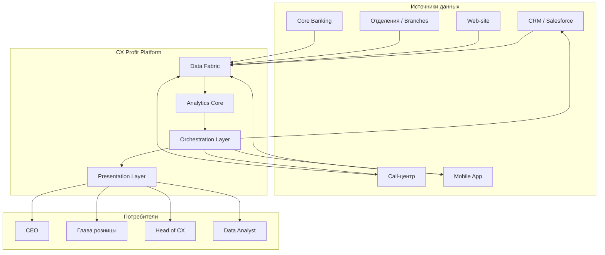

# Architecture — CX Profit Platform

## System Context



---

## Технологический стек

| Слой | Технологии | Назначение |
|---|---|---|
| **Data Fabric** | Apache Kafka, Flink, Spark, Feast, Neo4j | Stream & batch ingestion, feature store, Customer 360 graph |
| **Analytics Core** | Python, PyTorch, scikit-learn, DoWhy, EconML, LangChain | ML-модели, NLP, causal inference, LLM |
| **Orchestration** | FastAPI, Temporal, Airflow | Workflow, scheduling, action execution |
| **Presentation** | React, D3.js, Three.js, WebSockets | Command Center UI, real-time viz |
| **Infrastructure** | Kubernetes, Docker, Terraform, S3, PostgreSQL, Qdrant | Hosting, storage, vector DB |

---

## Data Flow

### 1. Ingestion (Real-time + Batch)
```
Sources → Kafka / Flink → Data Lake (S3) → Feast Feature Store → Graph DB
                               ↓
                         Batch Layer (Spark) → ML Training
```

### 2. ML Pipeline
```
Feature Store → Churn Prediction → Journey Mining → Sentiment Analysis
                     ↓                    ↓                ↓
              Customer Score         Graph Segments    Emotion Index
                     ↓                    ↓                ↓
              Causal Inference ←─────────┴─────────────────┘
                     ↓
              Recommendation Engine → Action Generator
```

### 3. Recommendation Engine Output
```json
{
  "alert_id": "alert_20260509_001",
  "type": "churn_risk",
  "severity": "high",
  "segment": "Premium",
  "clients_at_risk": 342,
  "churn_probability": 0.73,
  "financial_impact": {
    "annual_loss": 2700000,
    "confidence_interval": [2100000, 3400000]
  },
  "recommended_actions": [
    {
      "type": "retention_campaign",
      "expected_recovery": 0.35,
      "expected_value": 945000,
      "cost": 120000,
      "actions": [
        "send_personalized_offer",
        "priority_support_flag",
        "manager_outreach"
      ]
    }
  ],
  "causal_evidence": {
    "root_cause": "response_time_increase",
    "causal_effect": 0.12,
    "confidence": 0.89
  }
}
```

---

## Key Design Decisions

### Why Apache Kafka + Flink over batch-only?
- Клиентский experience — real-time. Отток случается сейчас, не "в следующем batch-окне".
- Flink обеспечивает exactly-once семантику для обработки транзакций

### Why Causal Inference (DoWhy) over correlation?
- Correlation ≠ causation. Банк не может тратить $M на изменение, основанное на ложной корреляции
- DoWhy строит Causal Graph (DAG) на основе доменных знаний

### Why Vector DB (Qdrant) for Voice Search?
- LLM + semantic search: находим не по ключевым словам, а по смыслу
- «Почему уходят» ≠ search for "churn" — разные контексты

### Why Graph DB (Neo4j) for Customer 360?
- Путь клиента — это граф, не таблица
- Анализ connected data (друзья клиента, семьи, компании) — только в графе

---

## API Design (Core Endpoints)

```
POST   /api/v1/ingest/event              # Принять событие (call, click, transaction)
GET    /api/v1/customer/{id}/journey      # Полный путь клиента
GET    /api/v1/segments/{id}/churn-risk   # Churn prediction по сегменту
POST   /api/v1/simulate/run              # Запустить симуляцию
GET    /api/v1/simulate/{id}/result      # Результат симуляции
POST   /api/v1/action/execute            # Выполнить action (retention campaign)
GET    /api/v1/voc/search?q=...          # Семантический поиск по Voice of Customer
GET    /api/v1/profit/waterfall          # Profit Waterfall
```

---

## Security & Compliance

- **RBAC**: 5 уровней доступа (Viewer → Operator → Analyst → Manager → Admin)
- **Data Masking**: PII masked на уровне данных, не UI
- **Audit Log**: все действия логируются с who / what / when
- **Encryption**: at rest (AES-256) + in transit (TLS 1.3)
- **152-ФЗ / GDPR**: механизм удаления данных клиента по запросу (Right to be forgotten)

---

## Deployment Model

```
┌──────────────┐     ┌──────────────┐     ┌──────────────┐
│  Dev Cluster  │────▶│  Staging     │────▶│  Production  │
│  (minimal)    │     │  (full data)  │     │  (HA, multi- │
│               │     │               │     │   AZ)        │
└──────────────┘     └──────────────┘     └──────────────┘
                     Canary deploys: 5% → 25% → 100%
```

**SLA Target:** 99.95% uptime (≈ 4h downtime/year)

---

## Monitoring & Observability

- **Metrics**: Prometheus + Grafana (request latency, ML inference time, data freshness)
- **Logs**: ELK stack (Elasticsearch, Logstash, Kibana)
- **Traces**: Jaeger (distributed tracing across ML pipeline)
- **Alerts**: PagerDuty integration for pipeline failures

---

## Cost Model (Approximate)

| Component | Monthly Cost (est.) |
|---|---|
| Kafka + Flink cluster | $15K - $40K |
| ML inference (GPU) | $10K - $30K |
| Storage (S3 + Qdrant) | $5K - $15K |
| Compute (K8s) | $20K - $60K |
| **Total** | **$50K - $145K** |

*For bank with 3-5M active clients*
